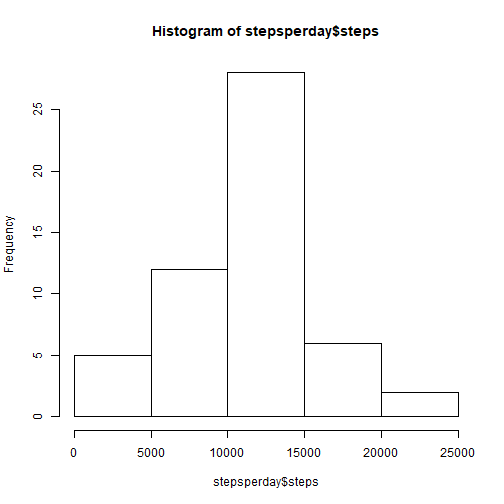
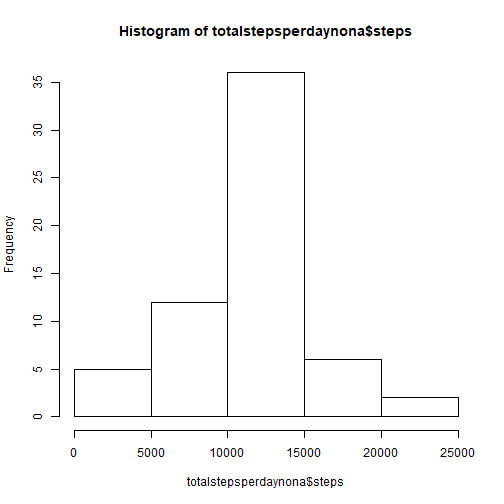
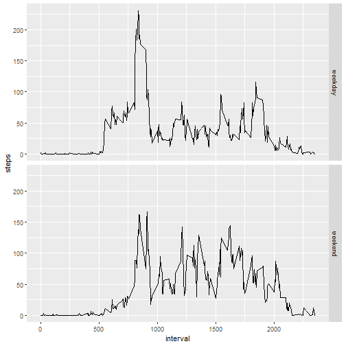

# Reproducible Research - Week 2 - Course Project 1#

## Set working directory

```r
setwd("C:/Users/adamr/Documents/R/Data Science Specialization/(5) Reproducible Research")
```

## Load the data

```r
activity <- read.csv("C:/Users/adamr/Documents/R/Data Science Specialization/(5) Reproducible Research/activity.csv")
```

## View/process/transform the data

```r
summary(activity)
```

```
##      steps                date          interval     
##  Min.   :  0.00   2012-10-01:  288   Min.   :   0.0  
##  1st Qu.:  0.00   2012-10-02:  288   1st Qu.: 588.8  
##  Median :  0.00   2012-10-03:  288   Median :1177.5  
##  Mean   : 37.38   2012-10-04:  288   Mean   :1177.5  
##  3rd Qu.: 12.00   2012-10-05:  288   3rd Qu.:1766.2  
##  Max.   :806.00   2012-10-06:  288   Max.   :2355.0  
##  NA's   :2304     (Other)   :15840
```

```r
str(activity)
```

```
## 'data.frame':	17568 obs. of  3 variables:
##  $ steps   : int  NA NA NA NA NA NA NA NA NA NA ...
##  $ date    : Factor w/ 61 levels "2012-10-01","2012-10-02",..: 1 1 1 1 1 1 1 1 1 1 ...
##  $ interval: int  0 5 10 15 20 25 30 35 40 45 ...
```

```r
names(activity)
```

```
## [1] "steps"    "date"     "interval"
```

```r
activity$date <- as.Date(activity$date)
activity$steps <- as.numeric(activity$steps)
```


## Total number of steps taken per day

```r
stepsperday <- aggregate(steps ~ date, activity, sum, na.rm=TRUE)
```


## Histogram of total number of steps taken per day

```r
hist(stepsperday$steps)
```




## Calculate and report the mean and median of the total number of steps taken per day

```r
meanstepsperday <- mean(stepsperday$steps)
meanstepsperday
```

```
## [1] 10766.19
```

```r
medianstepsperday <- median(stepsperday$steps)
medianstepsperday
```

```
## [1] 10765
```


## Make a time series plot (i.e. type = "l") of the 5-minute interval (x-axis) and the average number of steps taken, averaged across all days (y-axis)

```r
stepsperinterval <- aggregate(steps~interval, activity, mean, na.rm=TRUE)
plot(steps~interval, stepsperinterval, type = "l")
```


## Which 5-minute interval, on average across all the days in the dataset, contains the maximum number of steps?

```r
intervalwithmaxsteps <- stepsperinterval[which.max(stepsperinterval$steps),]$interval
intervalwithmaxsteps
```

```
## [1] 835
```

## Calculate and report the total number of missing values in the dataset (i.e. the total number of rows with NAs)

```r
totalmissingvalues <- sum(is.na(activity$steps))
totalmissingvalues
```

```
## [1] 2304
```

## Devise a strategy for filling in all of the missing values in the dataset. The strategy does not need to be sophisticated. For example, you could use the mean/median for that day, or the mean for that 5-minute interval, etc.  
### Create a function to get the mean steps per interval.

```r
getmeanstepsperinterval<-function(interval){
  stepsperinterval[stepsperinterval$interval==interval,]$steps
}
```

## Create a new dataset that is equal to the original dataset but with the missing data filled in.  
### Use for loop and function to fill in missing data.

```r
activitynafill<-activity
for(i in 1:nrow(activitynafill)){
  if(is.na(activitynafill[i,]$steps)){
    activitynafill[i,]$steps <- getmeanstepsperinterval(activitynafill[i,]$interval)
  }
}
```


## Make a histogram of the total number of steps taken each day and Calculate and report the mean and median total number of steps taken per day. Do these values differ from the estimates from the first part of the assignment? What is the impact of imputing missing data on the estimates of the total daily number of steps?

```r
totalstepsperdaynona <- aggregate(steps ~ date, activitynafill, sum)
hist(totalstepsperdaynona$steps)
```



```r
meanstepsperdaynona <- mean(totalstepsperdaynona$steps)
medianstepsperdaynona <- median(totalstepsperdaynona$steps)
```
### The mean is the same but the mean and the median are now the same.
```{}
print(meanstepsperdaynona)
print(medianstepsperdaynona)
```

## Create a new factor variable in the dataset with two levels - "weekday" and "weekend" indicating whether a given date is a weekday or weekend day.

```r
activitynafill$weekday <- weekdays(activitynafill$date)
for (i in 1:nrow(activitynafill)) {
  if (activitynafill[i,]$weekday %in% c("Saturday","Sunday")) {
    activitynafill[i,]$weekday<-"weekend"
  }
  else{
    activitynafill[i,]$weekday<-"weekday"
  }
}
```

## Make a panel plot containing a time series plot (i.e. \color{red}{\verb|type = "l"|}type = "l") of the 5-minute interval (x-axis) and the average number of steps taken, averaged across all weekday days or weekend days (y-axis). See the README file in the GitHub repository to see an example of what this plot should look like using simulated data.

```r
avgstepsbyinterval <- aggregate(activitynafill$steps ~ activitynafill$interval + activitynafill$weekday, activitynafill, mean)
names(avgstepsbyinterval) <- c("interval", "day", "steps")

library(ggplot2)
g <- ggplot(avgstepsbyinterval, aes(interval,steps))
g+geom_line()+facet_grid(day~.)
```




